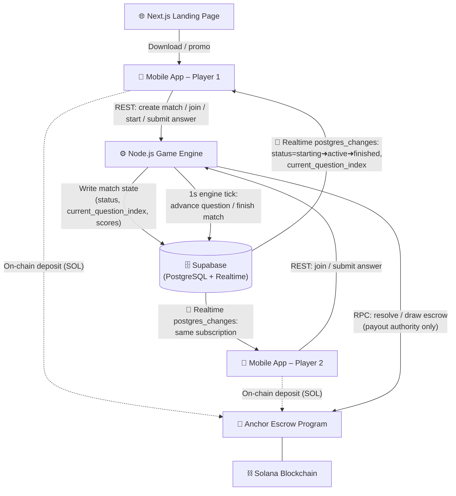

# TryHard - PVP Game on Solana

TryHard is a competitive 1v1 Trivia game built on the Solana blockchain. Players stake SOL in an on-chain escrow to answer questions generated by AI (automatically using the name entered by user) in real-time. The fastest player to answer correctly wins the round, and the overall winner sweeps the staked pool. 

This repository contains the entire TryHard ecosystem.

#### NOTE : the app only works on devnet

## Demo

you can view the demo video [here](https://youtu.be/-GH6r0gXpnY) or download the app from here : [tryhard.abhee.dev](https://tryhard.abhee.dev)
    Test Accounts    
account 1  
email: `test@test.com`  
pass `test@test.com`  
 
account 2  
email: `test@user.com`  
pass: `test@user.com`  

## 🏗️ Architecture Overview

The system is built on an **event-driven architecture**. The mobile clients do **not** have a persistent WebSocket connection to the Node.js server. Instead, all live game state is driven by **Supabase Realtime** (`postgres_changes`), which fans out database row updates to every subscribed client instantly.

### 🎮 Game Flow (Step by Step)

| Step | Who | What Happens |
|---|---|---|
| 1 | Player 1 | Calls `POST /match/create` on the backend. Match is created with `status=waiting` (or `status=funding` if staked). |
| 2 | Player 1 | If staked, signs a Solana tx to deposit SOL into the on-chain escrow PDA. Backend verifies tx and flips `status=waiting`. |
| 3 | Player 2 | Finds the match (public feed or 6-digit code). Calls `POST /match/:id/join`. Backend sets `status=ready`. |
| 4 | Both clients | **Supabase Realtime** fires a `postgres_changes UPDATE` event — both clients receive the `status=ready` update instantly in the Waiting Room. |
| 5 | Player 2 | If staked, signs and sends their escrow deposit tx. Backend verifies it. |
| 6 | Player 1 | Calls `POST /match/:id/start`. Backend sets `status=starting` and `started_at`. |
| 7 | Both clients | **Supabase Realtime** fires — both clients receive `status=starting` and show the 5-second pre-game countdown. |
| 8 | Backend Engine | 1-second polling loop detects the countdown has elapsed. Sets `status=active`, `current_question_index=0`, `question_start_time`. |
| 9 | Both clients | **Supabase Realtime** fires — clients receive `status=active` and enter the question phase, showing an interlude then the first question. |
| 10 | Both players | Answer questions by calling `POST /match/:id/answer`. Answers are stored in `match_answers`. |
| 11 | Backend Engine | Each tick, checks if both players answered OR time expired. If so, increments `current_question_index` (or finishes the match). |
| 12 | Both clients | **Supabase Realtime** fires on each `current_question_index` change → interlude countdown → next question shown. |
| 13 | Backend Engine | After last question, scores are tallied. `status=finished`, `winner_id` are written. If staked, escrow is resolved on-chain. |
| 14 | Both clients | **Supabase Realtime** fires `status=finished` → both clients are automatically navigated to the Results screen. |

## 📂 Project Structure

### `/app`
**The Mobile Application (Front-End)**
Built using **React Native (Expo)**, this is the core client application players install on their devices (iOS/Android).
- **Stack:** Expo, Expo Router, React Native, Zustand, Supabase JS Client
- **Real-time:** Uses `supabase.channel().on('postgres_changes', ...)` directly — no backend WebSocket. All game phases (`waiting`, `ready`, `starting`, `active`, `finished`) and question advancement are driven by Supabase Realtime events.
- **Run Locally:** `cd app` → `npm install` → `npx expo start`

### `/backend`
**The Game Engine & Authority Server**
A **Node.js (Express)** server responsible for match lifecycle management, AI question generation, and Solana escrow authority.
- **Stack:** Express, Supabase JS (server-side), Solana Web3.js, Google Generative AI (Gemini)
- **Game Engine:** A `setInterval` tick runs every **1 second**, polling `status=starting` and `status=active` matches from Supabase. It advances `current_question_index`, calculates final scores, and marks matches `finished`. Clients react to these DB changes via Realtime.
- **Run Locally:** `cd backend` → `pnpm install` → `pnpm dev`

### `/program`
**The Solana Smart Contract (Escrow)**
Written in **Rust (Anchor Framework)**, this on-chain program guarantees trustless financial wagers.
- **Stack:** Rust, Anchor
- **Features:** Initializes a PDA escrow for each match. The backend is the sole authority that can resolve (pay winner) or draw (refund both) the escrow. Players deposit directly via the mobile app.
- **Run Locally:** `cd program` → `anchor build` → `anchor test`

### `/website`
**The Promotional Landing Page**
A **Next.js** web application serving as the public-facing marketing and download page.
- **Stack:** Next.js 15+, Tailwind CSS v4, React 19
- **Run Locally:** `cd website` → `npm install` → `npm run dev`

---

## 🚀 Getting Started

To run this complex application locally, you will need to operate three separate terminals simultaneously:

1. **Start the Database / Backend:** Ensure your Supabase instance is running, supply the `.env` keys in `/backend`, and launch the Game Server.
2. **Start the Local Validator (Optional):** If testing smart contracts locally, run `solana-test-validator` and `anchor deploy` in the `/program` directory.
3. **Launch the Game Client:** Open `/app` and run `npx expo start` to launch the mobile bundler using an emulator or Expo Go.
