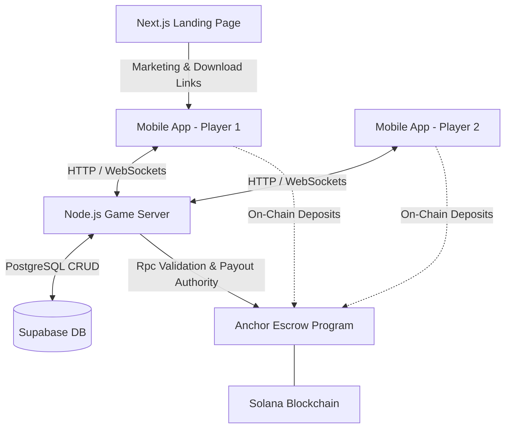

# TryHard - PVP Trivia Run on Solana

TryHard is a competitive 1v1 Trivia game built on the Solana blockchain. Players stake SOL in an on-chain escrow to answer trivia questions in real-time. The fastest player to answer correctly wins the round, and the overall winner sweeps the staked pool. 

This repository is a monorepo containing the entire TryHard ecosystem.

## 🏗️ Architecture Overview

The system runs on a deeply integrated stack connecting a Mobile App front-end to a centralized Node.js Game Server, governed by a trustless Solana Smart Contract (`program`) that handles the financial stakes in escrow.

## 📂 Project Structure

### `/app`
**The Mobile Application (Front-End)**
Built using **React Native (Expo)**, this is the core client application players install on their mobile devices (iOS/Android). 
- **Stack:** Expo, React Native, Expo Router, Zustand (State Management)
- **Features:** Wallet-Adapter integration (Phantom/Solflare), Real-time WebSocket subscriptions to Supabase, brutalist UI built with a unified `Blue-500` aesthetic and `CabinetGrotesk` typography.
- **Run Locally:** `cd app` -> `npm install` -> `npx expo start`

### `/backend`
**The Game Engine & Authority Server**
A **Node.js (Express)** backend responsible for managing match states, generating Trivia questions via AI, and acting as the secure authority for the Solana Escrow program.
- **Stack:** Express, Supabase JS, Solana Web3.js, Google Generative AI (Gemini).
- **Features:** JWT authentication, Match validation, and triggering the final "Payout" instruction on the smart contract once a winner is decided.
- **Run Locally:** `cd backend` -> `pnpm install` -> `pnpm dev`

### `/program`
**The Solana Smart Contract (Escrow)**
Written in **Rust (Anchor Framework)**, this on-chain program guarantees trustless financial wagers.
- **Stack:** Rust, Anchor.
- **Features:** Initializes a PDA (Program Derived Address) escrow account for matches. Accepts SOL deposits from Player 1 and Player 2. Only the designated `Backend Authority` keypair can instruct the contract to unlock and dispense funds to the winner.
- **Run Locally:** `cd program` -> `anchor build` -> `anchor test`

### `/website`
**The Promotional Landing Page**
A lightning-fast **Next.js** web application highlighting the game's features.
- **Stack:** Next.js 15+, Tailwind CSS v4, React 19.
- **Features:** Promotional UI and App Download routing. 
- **Run Locally:** `cd website` -> `npm install` -> `npm run dev`

---

## 🚀 Getting Started

To run this complex application locally, you will need to operate three separate terminals simultaneously:

1. **Start the Database / Backend:** Ensure your Supabase instance is running, supply the `.env` keys in `/backend`, and launch the Game Server.
2. **Start the Local Validator (Optional):** If testing smart contracts locally, run `solana-test-validator` and `anchor deploy` in the `/program` directory.
3. **Launch the Game Client:** Open `/app` and run `npx expo start` to launch the mobile bundler using an emulator or Expo Go.
